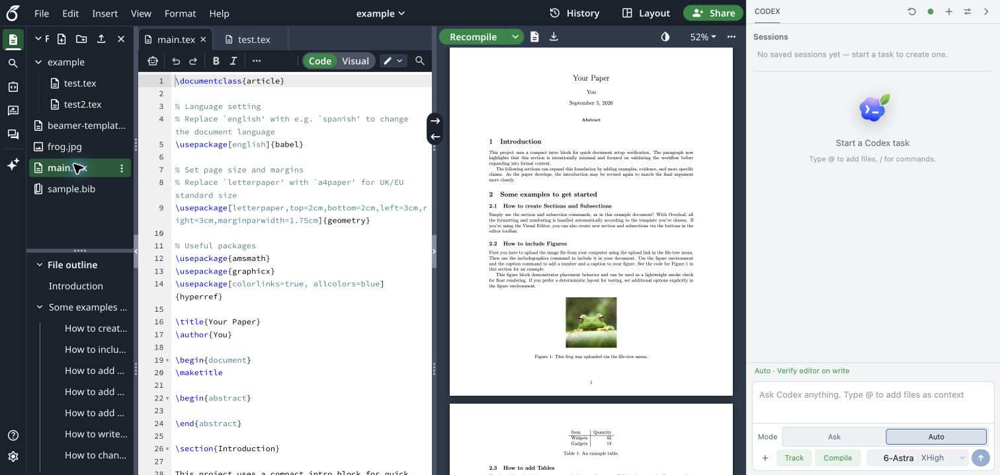
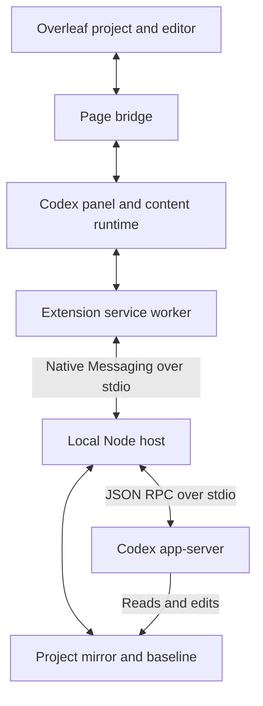

<div align="center">
  
  <h1>Codex Overleaf Link</h1>
  <p><strong>Empower Overleaf with Codex.</strong></p>
  <p>
    
    
    
    
    <a href="https://github.com/Ghqqqq/codex-overleaf-link/actions/workflows/test.yml"></a>
    
    
  </p>
</div>

---

## Why

Overleaf is great for collaborative LaTeX writing. Codex is great for AI-assisted editing. But switching between them breaks flow — you lose Overleaf's real-time collaboration, or you lose Codex's local intelligence.

Codex Overleaf Link adds a Codex panel directly inside Overleaf and mirrors the project locally. Use **Ask** to read and analyze, or **Auto** to edit the local workspace and write eligible changes back through the browser. Project rules, conflict checks, Track Changes integration, and per-run recovery help you control those writes.



*The example project with the v2.3.4 panel: Ask / Auto, Track / Compile, and model controls stay beside your document.*

[Install](#install) · [Task modes](#task-modes-and-review) · [Models & APIs](#models-and-api-providers) · [Workflows](#common-workflows) · [Troubleshooting](#faq-and-troubleshooting) · [Development](#development)

## Features

- **Ask and Auto** — analyze without Overleaf writes, or edit with conflict checks, project rules, and optional Track Changes. Inspect written text diffs and use the run's available Accept / Undo actions.
- **Live progress and follow-ups** — watch Codex events, cancel a task, queue the next input, or use **Guide** to send a queued message into the active turn when it is ready. A paused queue can be resumed from the panel.
- **Session history** — create, rename, resume, and delete sessions; copy a result or fork a conversation from an eligible turn. Recent-project history helps you return to earlier work.
- **Project context** — select files through `@` autocomplete or the **＋** tray, include `@compile-log`, and paste/drop files as attachments for the next turn.
- **Binary assets** — confirm Codex-created images, PDFs, and other supported assets before creating or replacing them in Overleaf; transfer is chunked to support files larger than a single Native Messaging response.
- **Compile feedback** — the **Compile** toggle requests Overleaf recompilation after eligible files are written and records the result. Ask mode does not trigger post-write compilation.
- **Project rules and preflight** — read-only / writable path rules gate browser writes; sensitive-content detection checks task context before sending it to Codex. File focus prioritizes context; use project rules to enforce writable paths.
- **Models and skills** — discover local Codex models, choose supported reasoning and speed settings, and install or select Codex Overleaf skills from the slash menu. Skill loading and individual skill enablement are configurable.
- **Local records and diagnostics** — preserve run outcomes and recovery evidence, inspect diagnostics, and export redacted issue-report bundles. Plugin Codex sessions use an isolated home.

### Experimental features

- **Third-party model providers** — configure Responses API, OpenAI-compatible Chat Completions, or Anthropic Messages endpoints in Settings. The local Codex CLI remains the agent runtime, with local protocol bridges adapting the selected endpoint. Compatibility varies by model and gateway; the built-in Codex provider remains the default.
- **Parallel subagents** — enable the `parallel-subagents` skill for decomposable tasks. The native host runs workers with assigned files; the skill can split a single file into section jobs. Worker progress appears in the timeline, and detected ownership violations are withheld from Overleaf writeback.
- **OT warm mirror** — optional, read-only observation of active Overleaf text edits keeps focused mirror files warm. It is off by default and falls back to the normal snapshot path when unavailable, stale, or inconsistent. Overleaf writeback still uses the page bridge.

## Requirements

| Requirement | Notes |
|-------------|-------|
| macOS / Windows / Linux | Native Messaging host targets the current user's browser registration location |
| Chrome / Chromium | macOS Chrome, Windows Chrome, and Linux Chrome are supported. Linux Chromium is supported only when installed with `--browser chromium`. macOS Chromium and Windows Chromium are not claimed as supported yet. |
| Node.js >= 20 | Powers the native host bridge |
| Git | Required by the one-command source installers and manual checkout flow |
| Codex CLI | Installed (`codex --version` to verify); sign in for the built-in Codex provider. Custom providers also use the local Codex CLI. |
| Overleaf account | Access to the target project on `overleaf.com` |
| TeX distribution *(optional)* | For `latexmk` / local compile checks |

## Install

Codex Overleaf Link has two parts: a **native host** (a local Node bridge) and the **Chrome extension**. Pick one of the two install paths below, then open Overleaf.

Either way, the final **Load unpacked** click is manual — Chrome does not let any installer or script load an unpacked extension for you.

### Option A — installer script (recommended)

One command installs the managed native host **and** managed extension runtime. On macOS/Linux it also creates the visible `~/Codex Overleaf Link Extension` shortcut when that path is available. The script attempts to copy the extension path on macOS and Windows; on macOS it also attempts to open Chrome's extensions page. Every platform prints the folder to load. Future signed stable updates target this same managed directory.

macOS / Linux:

```bash
CODEX_OVERLEAF_REF=v2.3.5 bash -c "$(curl -fsSL https://raw.githubusercontent.com/Ghqqqq/codex-overleaf-link/v2.3.5/install.sh)"
```

Windows PowerShell:

```powershell
iwr https://raw.githubusercontent.com/Ghqqqq/codex-overleaf-link/v2.3.5/install.ps1 -OutFile install.ps1
$env:CODEX_OVERLEAF_REF='v2.3.5'
powershell -ExecutionPolicy Bypass -File install.ps1
```

Then open `chrome://extensions`, enable **Developer mode**, click **Load unpacked**, and choose the extension folder printed by the installer. If the installer reports that it copied the path, you can paste it into the folder picker.

### Option B — npm managed install

`npm exec` installs the same managed native host and extension runtime without keeping a source checkout. Use it if you prefer a pinned npm package.

```bash
npm exec --yes codex-overleaf-link@2.3.5 -- install-managed
```

Then, in `chrome://extensions`, enable **Developer mode**, click **Load unpacked**, and select the managed extension path printed by the command. The Release extension zip remains available for explicitly unmanaged/manual installations.

### Open Overleaf

Open a project on `overleaf.com` — the Codex panel appears on the right. Use its diagnostics to confirm the native host is connected, then start in **Ask** mode. When you want edits, select **Auto** and choose whether **Track** should be enabled. Auto writes eligible changes directly; Track records supported text edits in Overleaf Reviewing for inspection and acceptance afterward. See [Task Modes And Review](#task-modes-and-review).

Close the panel from its header and reopen it with the Codex edge control on the Overleaf page. The extension popup controls whether that edge entry is shown. The panel supports dark, light, and system appearance, with English and Chinese interface text.

Appearance, language, and global skill preferences synchronize across Overleaf tabs in the same Chrome profile and are restored when you reopen the dashboard or a project. The Preload project context setting is also preserved across refreshes.

The bundled extension key gives the official build a stable id, so normal installs do not need `--extension-id`. If Chrome assigns a custom build a different id, rerun the installer for that installation type with `--extension-id <chrome-extension-id>` so the native manifest `allowed_origins` entry matches. See [Extension ID](#extension-id).

<details>
<summary><strong>Manual checkout install</strong> (custom location)</summary>

```bash
git clone https://github.com/Ghqqqq/codex-overleaf-link.git
cd codex-overleaf-link
npm ci
npm run build:content
npm run install:native
```

Then load `extension/` as an unpacked extension in Chrome. This checkout installation is unmanaged: rebuild and reload the extension after changes, and reinstall the native host after changes to its runtime. If Chrome assigns a different extension id, rerun `npm run install:native -- --extension-id <chrome-extension-id>`.

</details>

## Task Modes And Review

There are two task modes, Ask and Auto. Track is a separate setting for Auto writes.

| Mode / Track setting | What happens | How to inspect the result |
|------|--------------|--------------------------|
| **Ask** | Codex reads and analyzes the project. Local changes, if any, are not sent back to Overleaf. | Read the answer; switch to Auto when you want edits. |
| **Auto + Track on** | Eligible changes are written immediately; supported text edits are recorded in Overleaf Reviewing / Track Changes. The run is blocked if the required mode cannot be confirmed. | Inspect the written diff and Overleaf tracked edits, then use the run's available **Accept** or **Undo** action. |
| **Auto + Track off** | Eligible changes are written after confirming Overleaf Editing mode. | Inspect the written diff and use **Undo** where recovery evidence is available. |

Auto text writes do not wait for a per-hunk approval step. Deletes and binary create/overwrite operations require separate confirmation. Track applies to supported text edits; it does not make every file-tree or binary operation reversible.

**Accept** finalizes this run's tracked text edits and leaves Overleaf in Editing mode. If the operation unexpectedly creates new tracked changes, the extension attempts to roll it back and reports what could be verified.

**Undo** uses the run's saved recovery information. Concurrent changes or incomplete verification can prevent a full restoration. Cancel stops further work but does not automatically undo writes that already reached Overleaf; inspect the run card for the written parts and available recovery actions.

Suggest mode was removed in v2.3.1. For a reviewable editing workflow, use **Auto + Track** and inspect the changes after they are written.

## Models And API Providers

The default **Built-in Codex** option uses the authentication, model catalog, and provider configuration of your local Codex CLI. You can also connect an experimental third-party API while keeping the same Overleaf panel, local workspace, and Codex agent workflow.

### Add or switch a provider

1. Open **Project Settings → Model providers → Configure**, then choose **+ Add provider**.
2. Enter a **Provider name**, **Base URL**, **API key**, and **Default model** ID. Add other model IDs one per line in **Additional models**. Use the exact IDs accepted by your endpoint; custom providers use this configured list. HTTPS is required except for localhost.
3. Under **Advanced compatibility**, leave **API protocol** on Auto or select the protocol your endpoint supports. If the URL already ends with the complete protocol endpoint, enable **Base URL is the full protocol endpoint**.
4. Review the endpoint disclosure. **Test connection** is optional and sends a live probe to the selected test model. Choose **Save** to keep the profile, or **Save and use for this project** to select it for future runs in this project.

To switch between saved providers, select one in the dialog and choose **Use for this project**, then confirm **Switch provider** when prompted. To return to the default, select **Built-in Codex → Use for this project**. Back in the composer, open the model control to choose a configured model and its supported reasoning settings. The **Current project** label identifies the selected provider.

Provider profiles are shared locally across projects, while the active choice applies to **all sessions in the current project**. Switching keeps existing run history and starts fresh provider threads for future turns; model, reasoning, and speed choices may change. Editing a shared profile can affect other projects using it. Submitted and queued runs retain their captured provider configuration; resubmit if a profile change makes that captured revision unavailable.

The project dashboard lets you manage shared provider profiles. Open a project before choosing which provider it should use.

### Supported API formats

| API protocol | Use it for |
|----------|------------|
| **Auto (detect during test)** | Negotiate a compatible route during a connection test or first use. |
| **Responses API** | Endpoints that accept the Responses API format. |
| **Chat Completions** | OpenAI-compatible chat completion endpoints. |
| **Anthropic Messages** | Endpoints that accept the Anthropic Messages format. |

Advanced settings also expose authentication headers, streaming/buffered response behavior, reasoning compatibility, and gateway-specific headers or request overrides. Configure these to match your provider's documentation. A successful probe checks one model and route; tool calling, reasoning, and long-running task behavior can still vary by endpoint. API keys are stored locally by the native host, and task context is sent to the selected endpoint.

## Context And Attachments

Type `@` and choose a file, or select it in the **＋** tray. Choosing a file adds it to persistent focus context; up to five files can be selected, and the tray lets you remove or clear them. With a complete project snapshot, Codex may also read and edit related files. Focus is a hard writeback boundary only for restricted partial-snapshot and OT warm-start runs; use project governance rules for a persistent write restriction.

Include `@compile-log` to request the current project's compile log, errors, and warnings. For a paragraph or section, select its file and name the section or quote the target text in your request.

Paste or drop PDFs, images, or other files into the composer as turn-scoped context. The composer accepts **8 attachments**, up to **12 MiB each** and **32 MiB total raw size** per turn. These files are staged locally for Codex and excluded from Overleaf writeback. Unsent attachment restoration after a page reload is limited to a small subset, so check the attachment strip before submitting.

Generated binary writeback is a separate operation: supported assets up to **10 MiB per file** are offered for confirmation and sent in chunks. LaTeX build outputs are filtered; in particular, a changed root-level PDF with a matching root TeX source is treated as a build artifact.

## Common Workflows

- **Understand a project** — use Ask to explain the document structure, equations, or a selected file without writing to Overleaf.
- **Fix a compile error** — include `@compile-log` in Ask for diagnosis. To apply a fix, switch to Auto, choose Track as needed, leave Compile enabled, and inspect the written changes and compile result.
- **Rewrite or translate a section** — choose its file from `@` autocomplete, name the section and desired changes, and use Auto + Track. Inspect the edits in Overleaf, then Accept or Undo the run as appropriate.
- **Create a figure** — provide references as composer attachments, ask Codex to create a supported asset and update the LaTeX in Auto, and review the separate asset confirmation. Check the run report for any skipped files.
- **Continue or try an alternative** — queue a follow-up while Codex is running, use Guide for an immediate correction, or fork an eligible completed turn to explore another approach. A conversation fork shares the same Overleaf project; it does not create a project copy.
- **Polish several sections in parallel** — enable the experimental `parallel-subagents` skill, specify the sections or files, and use Auto + Track to inspect the combined changes after writeback.

## Update

Managed installations **check** for signed stable updates automatically. When an update is available, choose **Update now** in the update notice or **Settings → Software updates** to authorize that version. The updater then downloads and verifies the coordinated extension/native bundle, waits until connected Overleaf tabs are saved and idle and the native host has no active work, and applies both components together. A failed health check restores the previous version. The update notice also offers postponement and progress details.

Stable updates use signed release metadata and artifact hashes; draft and prerelease versions are not selected. Releases that require a different Bootstrap protocol need a managed reinstall. The updater does not silently add Chrome permissions.

Re-run `install-managed` for recovery or migration, including when the panel reports **Native host update required**. After recovery, reload the extension in `chrome://extensions` and refresh Overleaf. Unmanaged checkout or Release-zip installations require a manual extension/native update.

### Managed-update baseline

v2.2.0 introduced Bootstrap protocol 2. Existing v2.1.x managed installations need to run the pinned `install-managed` command once, then reload the extension and Overleaf. Later protocol-2 releases use the in-product updater for compatible runtime, style, vendor, and Native Host changes. Bootstrap protocol is separate from the Native Messaging compatibility handshake described below.

## npm Managed CLI

npm installs, updates, and uninstalls the coordinated managed extension/native pair. Diagnostics still target the native host. The legacy `install-native` command remains available only for explicitly unmanaged extension directories.

| Action | Command |
|--------|---------|
| Install / recover / migrate | `npm exec --yes codex-overleaf-link@2.3.5 -- install-managed` |
| Diagnose | `npm exec --yes codex-overleaf-link@2.3.5 -- doctor` |
| Uninstall | `npm exec --yes codex-overleaf-link@2.3.5 -- uninstall-managed` |

Use `--extension-id <chrome-extension-id>` only for a custom/dev unpacked extension id that differs from the official bundled id.

<a id="uninstall"></a>
<details>
<summary><strong>Uninstall</strong></summary>

Remove the managed extension/native installation (append `--browser chromium` on Linux Chromium):

```bash
npm exec --yes codex-overleaf-link@2.3.5 -- uninstall-managed
```

The same command works in Windows PowerShell. It also applies to current `install.sh` / `install.ps1` installations, which install the managed pair.

For an unmanaged checkout or native-only installation, use `npm run uninstall:native` from the checkout, or:

```bash
npm exec --yes codex-overleaf-link@2.3.5 -- uninstall-native
```

If you are removing an older native-only source installation and still have its source checkout, its bundled uninstaller can also be invoked directly:

```bash
node ~/.codex-overleaf/source/scripts/uninstall-native-host.mjs
```

```powershell
node $env:LOCALAPPDATA\CodexOverleaf\source\scripts\uninstall-native-host.mjs
```

`uninstall-managed` removes the registered Native Messaging host, bridge executable, managed extension, and versioned native runtime. `uninstall-native` removes the native-only registration and runtime copy. Neither command clears browser session history/settings, project mirrors, plugin Codex history, provider credentials, or stored skills.

Remove the extension entry from `chrome://extensions` as well. To erase saved Codex Overleaf history, use the panel's history controls before removing the extension. Windows keeps the native installation under `%LOCALAPPDATA%\CodexOverleaf` and mirrors, plugin Codex history, providers, and skills under `%USERPROFILE%\.codex-overleaf`; full filesystem cleanup requires both roots. See [Local Data And Cleanup](#local-data-and-cleanup) for the separate browser and filesystem cleanup steps.

</details>

## FAQ And Troubleshooting

**Native host missing or update required**

For a managed installation, rerun the [managed installer](#install), reload the extension in `chrome://extensions`, then refresh the Overleaf tab. This recovers the coordinated extension/native pair after an incomplete installation or incompatible runtime update.

```bash
npm exec --yes codex-overleaf-link@2.3.5 -- install-managed
```

For an unmanaged checkout, rebuild the extension and reinstall its native host from the same checkout. Use PowerShell installation commands on Windows.

**Codex CLI not found**

Confirm `codex --version` works in a new terminal and, for the built-in provider, that you are logged in. On macOS/Linux, reinstalling the native host regenerates the launcher after PATH changes. On Windows, confirm `Get-Command codex` succeeds in PowerShell before reinstalling.

**Extension id mismatch**

Copy the id shown in `chrome://extensions` and reinstall the native host with that id (see [Extension ID](#extension-id)).

**Linux Chromium does not connect**

Reinstall the native host with `--browser chromium`, reload the unpacked extension, and refresh Overleaf. The Chromium manifest path is different from Chrome's path.

**Diagnostics and logs**

Use the diagnostics export for issue reports. Diagnostics are intended to exclude project text, prompt bodies, compile logs, raw diffs, binary content, and raw secrets by default. If you manually attach logs, review and redact file names, project ids, tokens, prompts, and document text.

**Stale collaborator conflict**

The stale-write guard checks the original content and expected patch ranges. It can preserve unrelated edits when the target ranges still match; conflicting or unaligned changes are skipped. Inspect the skipped-file report and collaborator edits, then rerun from fresh context. A project switch can also stop a write because it no longer targets the project where the run started.

**Track / Accept / Undo is unavailable**

Track requires an Overleaf Reviewing state that the extension can verify. Accept and Undo depend on the run's actual writes and saved recovery evidence; some operations or later collaborator edits prevent full recovery. Follow the run card's specific next action. Turning Track off selects ordinary Editing for future Auto runs.

**Governance blocked write**

Project governance rules can mark paths read-only or restrict writable paths. Switch to ask-only mode, adjust the project governance settings, or narrow the requested edit to an allowed path.

**Sensitive preflight warning**

Sensitive preflight checks task context for likely tokens or secrets before a Codex run. Review the reported files and redact or remove sensitive content. A selected focus file does not exclude the rest of a complete project snapshot. Explicit confirmation is available only when allowed by the project's sensitive-content settings.

**Attachments and binary limits**

Composer attachments are context, while generated binary create/overwrite operations have a separate confirmation. Writeback uses chunked transfer up to the 10 MiB per-file limit. Unsupported types, oversized files, and filtered build artifacts are reported as skipped local changes. See [Context And Attachments](#context-and-attachments).

**A queued follow-up or fork cannot run**

A queued turn retains the settings captured when it was submitted. Changed or deleted provider configuration can require a new submission. Guide becomes available when the active Codex turn can receive it; otherwise the message stays queued. Fork requires a recorded Codex turn position and is disabled when that position is unavailable.

## How It Works



**Task lifecycle:**

1. The extension captures the submitted mode, provider/model settings, Track/Compile choices, and focus files, then prepares a project snapshot or a verified reusable mirror.
2. The native host synchronizes the snapshot and records a baseline. A partial snapshot is handled differently from a complete project snapshot.
3. Codex runs against the local workspace through `codex app-server`, with an isolated Codex home, session history, and streaming events.
4. The native host collects actual file changes, computes text diffs/patches, and prepares supported binary transfers. Ask returns its answer without writeback.
5. Auto applies eligible operations through the browser after checking project identity, path rules, edit mode, and the expected text at each patch. Conflicting operations are skipped and reported.
6. The extension records recovery evidence immediately after writes, then verifies save state, updates the mirror baseline, and optionally recompiles. The report distinguishes writes from save and compile verification.

Tracked-text acceptance uses Overleaf's native undo path to restore the pre-run text, then replays the run's edits with tracking off. The page bridge checks that Editing mode remains stable and attempts rollback if replay unexpectedly creates new tracked changes.

## Development

Install locked development dependencies and build the content script before loading the checkout extension:

```bash
npm ci
npm run build:content
npm test
npm run verify:source
npm run verify:npm-package
npm run verify:update-boundary
npm run check:architecture
npm run benchmark:large
```

The project has no npm runtime dependencies. Development uses pinned **esbuild**; Markdown and math rendering libraries are vendored in the extension. Tests use Node's built-in runner and include VM/mock browser integration tests. The [CI workflow](.github/workflows/test.yml) currently uses Node 24.18.0 on macOS, Ubuntu, and Windows, with the managed-update hop rehearsal on Ubuntu.

The isolated-world bundle is generated from [content-entry.mjs](extension/entries/content-entry.mjs). Edit the source modules, then run `npm run build:content` and reload the extension; page-world bridge modules remain separate. For an unmanaged checkout, rerun `npm run install:native` after changing native runtime or shared files copied into it. `npm run bridge` starts the stdio Native Host directly for protocol work.

To update an existing managed installation from a prepared checkout, run `npm run install:managed` after building, then reload the extension and Overleaf.

| Area | Entry points |
|------|--------------|
| Panel and task orchestration | `extension/src/content/contentRuntime.js`, `extension/src/content/runController.js` |
| Page snapshot and writeback | `extension/src/pageBridge.js`, `extension/src/page/snapshotRouter.js`, `extension/src/page/writebackRouter.js` |
| Browser/native transport | `extension/src/background.js`, `native-host/src/index.js` |
| Codex and local mirror | `native-host/src/taskRunnerRuntime.js`, `native-host/src/codexSessionRunner.js`, `native-host/src/mirrorWorkspace.js` |
| Shared contracts and persistence | `extension/src/shared/`, `extension/src/content/scopedPersistenceCoordinator.js` |
| Managed updates and packaging | `extension/bootstrap/`, `extension/src/backgroundUpdateCoordinator.js`, `native-host/src/updateManager.js`, `scripts/` |

For a real browser smoke check, provide an Overleaf project URL accessible in the Chrome profile used for the test:

```bash
npm run smoke:extension -- --url 'https://www.overleaf.com/project/<project-id>' --probe panel,native,project,diagnostics --json .local/smoke.json
```

The smoke script launches Chrome with a temporary profile by default. Use `--profile-dir <test-profile-dir> --keep-profile` when you need a dedicated profile with an Overleaf login, and ensure its native host is registered. For release work, see `npm run build:release`, `npm run verify:release-artifacts`, and `npm run rehearse:update-hop`.

## Browser Support

| Platform | Supported browser path | Notes |
|----------|------------------------|-------|
| macOS | Google Chrome | Use the default installer. macOS Chromium native registration is not documented as supported. |
| Windows | Google Chrome | Use the PowerShell installer. Windows Chromium native registration is not documented as supported. |
| Linux | Google Chrome | Use the default installer. |
| Linux | Chromium | Pass `--browser chromium` to install or uninstall the native host. |

The shipped extension targets `https://overleaf.com/project` and `https://www.overleaf.com/project` and their project pages. Other Overleaf deployments are not included in its host permissions.

Linux Chromium install or update:

```bash
CODEX_OVERLEAF_REF=v2.3.5 bash -c "$(curl -fsSL https://raw.githubusercontent.com/Ghqqqq/codex-overleaf-link/v2.3.5/install.sh)" -- --browser chromium
```

Linux Chromium uninstall:

```bash
npm exec --yes codex-overleaf-link@2.3.5 -- uninstall-managed --browser chromium
```

## Extension ID

This repo ships a stable Chrome extension `key`, producing the deterministic id:

```
illdpneeeopfffmiepaejglgmhpmdhdc
```

The installer uses this id by default. For a managed installation with a custom id, rerun the managed installer with the id shown in `chrome://extensions`:

```bash
npm exec --yes codex-overleaf-link@2.3.5 -- install-managed --extension-id <your-chrome-extension-id>
```

For an unmanaged extension, use the native-only installer:

```bash
npm exec --yes codex-overleaf-link@2.3.5 -- install-native --extension-id <your-chrome-extension-id>
```

Both npm commands work in PowerShell. Source installers also accept the `CODEX_OVERLEAF_EXTENSION_ID` environment variable. The Native Messaging manifest's `allowed_origins` must match the loaded extension id.

## GitHub Release Artifacts

The v2.3.5 GitHub Release contains:

- `codex-overleaf-link-extension-v2.3.5.zip`: loadable Chrome extension package for manual unpacked installation.
- `codex-overleaf-native-host-v2.3.5.tar.gz`: native host runtime files used by the installer and release verification.
- `codex-overleaf-update-v2.3.5.tar.gz`: coordinated extension/native bundle used by the managed updater.
- `codex-overleaf-link-2.3.5.tgz`: npm native host CLI package for pinned install, doctor, and uninstall flows.
- `install.sh`: release-pinned macOS / Linux installer that defaults to `v2.3.5` when run directly from the release artifact.
- `install.ps1`: release-pinned Windows PowerShell installer that defaults to `v2.3.5` when run directly from the release artifact.
- `uninstall-native-host.mjs`: native host uninstaller that removes the Chrome Native Messaging manifest, bridge executable, and runtime copy.
- `nativeHostPlatform.js`, `manifest.js`, `runtimeInstaller.js`: helper files required by the loose uninstaller asset.
- `SHA256SUMS`, `release-manifest.json`, and `release-manifest.sig`: checksums, release metadata, and its Ed25519 signature.
- `release-notes.md`: release notes shipped with the artifacts.

## Local Data And Cleanup

Codex Overleaf Link has no hosted application backend or default telemetry. It stores project mirrors and session data locally, but task context is sent to Codex or the selected third-party model endpoint during a run. Project rules control browser writes; they do not remove files from the model's reading context.

Codex Overleaf history and browser extension settings use different stores. The content script opens the `codex-overleaf` IndexedDB database in the Overleaf page's origin; extension preferences use `chrome.storage.local`. Removing the extension should not be treated as erasing that page-origin database. See Chrome's [content-script storage behavior](https://developer.chrome.com/docs/extensions/develop/concepts/storage-and-cookies#storage).

| Area | Location | Contents |
|------|----------|----------|
| Browser IndexedDB | Database `codex-overleaf` under the Overleaf page origin | Sessions, turns, events, artifacts, and audit logs. |
| Browser extension storage | `chrome.storage.local` | Global UI preferences in `codexOverleafGlobalPrefsV1`, plus project settings, governance rules, selected skill ids, and panel state. |
| Managed extension | `~/.codex-overleaf/managed/extension` on macOS/Linux; `%LOCALAPPDATA%\CodexOverleaf\managed\extension` on Windows | Stable directory loaded into Chrome, including bootstrap and replaceable runtime files. |
| Managed native host | `~/.codex-overleaf/managed/native` on macOS/Linux; `%LOCALAPPDATA%\CodexOverleaf\managed\native` on Windows | Versioned runtimes, active/previous version pointers, bootstrap launcher, and update staging. |
| Source installer checkout | `~/.codex-overleaf/source` on macOS/Linux; `%LOCALAPPDATA%\CodexOverleaf\source` on Windows | Source retained by `install.sh` / `install.ps1`; npm managed installs do not require this checkout. |
| Native-only runtime | `~/.codex-overleaf/native-host-runtime` on macOS/Linux; `%LOCALAPPDATA%\CodexOverleaf\native-host-runtime` on Windows | Runtime copy for unmanaged/native-only installations. The Windows Native Messaging manifest also lives in this directory for managed installs. |
| Native bridge | `~/.codex-overleaf/codex-overleaf-bridge` on macOS/Linux; `%LOCALAPPDATA%\CodexOverleaf\codex-overleaf-bridge.cmd` on Windows | Native Messaging launcher executable. |
| Project mirrors | `~/.codex-overleaf/projects` on macOS/Linux, `%USERPROFILE%\.codex-overleaf\projects` on Windows | Local mirror workspaces and mirror metadata for each Overleaf project. |
| Plugin Codex home | `~/.codex-overleaf/codex-home` on macOS/Linux, `%USERPROFILE%\.codex-overleaf\codex-home` on Windows | Isolated Codex home for plugin runs. It copies auth/config metadata but does not reuse global Codex sessions or inherit global Codex personalization. |
| Codex Overleaf skills | `~/.codex-overleaf/skills` on macOS/Linux, `%USERPROFILE%\.codex-overleaf\skills` on Windows | Project/plugin skills managed by the extension. |
| Provider configuration | `~/.codex-overleaf/providers.json` and `provider-secrets.json`; under `%USERPROFILE%\.codex-overleaf` on Windows | Model provider profiles and separately stored API keys. |
| Native logs | `~/.codex-overleaf/native-host.log` on macOS/Linux, `%LOCALAPPDATA%\CodexOverleaf\native-host.log` on Windows | Native debug events with content length summaries where possible. |
| Launcher logs | `~/.codex-overleaf/native-host-launcher.log` on macOS/Linux | POSIX launcher startup path and Node diagnostics. The Windows `.cmd` launcher does not currently emit a separate launcher log. |

These are default locations; custom installation paths and environment overrides may differ. Skill loading toggles default to enabled. In Settings:

- `Load local Codex skills` loads the user's local Codex skill environment from the global Codex home into the isolated `~/.codex-overleaf/codex-home`: `~/.codex/skills`, local Codex `plugins`, `superpowers`, and related skill/plugin configuration. Turning it off hides user/system Codex skills and local Codex plugins from Codex Overleaf runs. This affects only the plugin CODEX_HOME prepared for the run; it does not write to or reuse global `~/.codex/sessions`.
- `Load Codex Overleaf skills` loads project/plugin skills managed by the extension from `~/.codex-overleaf/skills` on macOS/Linux or `%USERPROFILE%\.codex-overleaf\skills` on Windows into the same isolated Codex home. Turning it off hides those extension-managed skills while preserving the stored skill files. If both toggles are off, the run starts without local Codex skills or Codex Overleaf skills.

The isolated plugin Codex home copies auth and config metadata but excludes global Codex personalization: it does not copy `~/.codex/AGENTS.md`, strips the top-level `personality` key from the copied `config.toml`, and does not link the global `rules` or `memories` directories.

Native registration paths:

| Platform/browser | Registration path |
|------------------|-------------------|
| macOS Chrome | `~/Library/Application Support/Google/Chrome/NativeMessagingHosts/com.codex.overleaf.json` |
| Linux Chrome | `~/.config/google-chrome/NativeMessagingHosts/com.codex.overleaf.json` |
| Linux Chromium | `~/.config/chromium/NativeMessagingHosts/com.codex.overleaf.json` |
| Windows Chrome | `HKCU\Software\Google\Chrome\NativeMessagingHosts\com.codex.overleaf`, pointing to `%LOCALAPPDATA%\CodexOverleaf\native-host-runtime\com.codex.overleaf.json` |

Full uninstall and data deletion:

1. Before removing the extension, use **Settings → History & storage → Clear all history** if you want to erase saved run history. Repeat for each browser profile and Overleaf origin you used. If the extension is already removed, the `codex-overleaf` database can be deleted from the Overleaf page's **DevTools → Application → IndexedDB**. Target that database rather than clearing all Overleaf site data.
2. Run `uninstall-managed` for a managed installation, or `uninstall-native` for an unmanaged/native-only installation, as described under [Uninstall](#uninstall). Use `--browser chromium` for Linux Chromium.
3. Remove the extension entry from `chrome://extensions` in each browser profile. Chrome removes that extension's `chrome.storage.local` settings when it is uninstalled. See the [Chrome storage API documentation](https://developer.chrome.com/docs/extensions/reference/api/storage#storage_areas).
4. To erase all remaining default filesystem data, including project mirrors, plugin Codex history, provider credentials, skills, and source checkouts, use the appropriate command below. Also remove any custom installation roots you configured.

macOS/Linux:

```bash
rm -rf ~/.codex-overleaf ~/Codex\ Overleaf\ Link\ Extension
```

Windows PowerShell:

```powershell
Remove-Item -Recurse -Force "$env:LOCALAPPDATA\CodexOverleaf", "$env:USERPROFILE\.codex-overleaf" -ErrorAction SilentlyContinue
```

Composer attachments are staged under `.codex-overleaf-attachments` inside the mirror workspace and are ignored during writeback. Submission clears the composer strip; it is not a promise of immediate deletion from local mirrors or Codex history.

## Compatibility Matrix

Use this matrix for release-candidate signoff and compatibility reports. Record exact versions from the machine under test before publishing release guidance.

| Field | macOS Chrome | Windows Chrome | Linux Chrome | Linux Chromium |
|-------|--------------|----------------|--------------|----------------|
| OS/version/arch | Record exact macOS version and `arm64`/`x64`. | Record exact Windows version and `arm64`/`x64`. | Record distro, version, and `arm64`/`x64`. | Record distro, version, and `arm64`/`x64`. |
| Browser/channel/version | Google Chrome channel and version. | Google Chrome channel and version. | Google Chrome channel and version. | Chromium channel/package and version. |
| Install mode | Managed pair recommended; unmanaged Release zip or checkout also available. | Same as macOS Chrome. | Same as macOS Chrome. | Managed or unmanaged; register with `--browser chromium`. |
| Extension id | Bundled id `illdpneeeopfffmiepaejglgmhpmdhdc`, or actual custom id passed with `--extension-id`. | Bundled id `illdpneeeopfffmiepaejglgmhpmdhdc`, or actual custom id passed with `--extension-id`. | Bundled id `illdpneeeopfffmiepaejglgmhpmdhdc`, or actual custom id passed with `--extension-id`. | Bundled id `illdpneeeopfffmiepaejglgmhpmdhdc`, or actual custom id passed with `--extension-id`. |
| Installer/update command | `npm exec --yes codex-overleaf-link@2.3.5 -- install-managed` | `npm exec --yes codex-overleaf-link@2.3.5 -- install-managed` | `npm exec --yes codex-overleaf-link@2.3.5 -- install-managed` | `npm exec --yes codex-overleaf-link@2.3.5 -- install-managed --browser chromium` |
| Uninstall command | `npm exec --yes codex-overleaf-link@2.3.5 -- uninstall-managed` | `npm exec --yes codex-overleaf-link@2.3.5 -- uninstall-managed` | `npm exec --yes codex-overleaf-link@2.3.5 -- uninstall-managed` | `npm exec --yes codex-overleaf-link@2.3.5 -- uninstall-managed --browser chromium` |
| Manifest/registry path | `~/Library/Application Support/Google/Chrome/NativeMessagingHosts/com.codex.overleaf.json` | `HKCU\Software\Google\Chrome\NativeMessagingHosts\com.codex.overleaf` -> `%LOCALAPPDATA%\CodexOverleaf\native-host-runtime\com.codex.overleaf.json` | `~/.config/google-chrome/NativeMessagingHosts/com.codex.overleaf.json` | `~/.config/chromium/NativeMessagingHosts/com.codex.overleaf.json` |
| Managed runtime paths | `~/.codex-overleaf/managed/extension` and `~/.codex-overleaf/managed/native`. | `%LOCALAPPDATA%\CodexOverleaf\managed\extension` and `%LOCALAPPDATA%\CodexOverleaf\managed\native`. | Same as macOS Chrome. | Same as macOS Chrome. |
| Node/Git/Codex/TeX | Record exact versions; see [Requirements](#requirements) for installation and provider prerequisites. | Same as macOS Chrome. | Same as macOS Chrome. | Same as macOS Chrome. |
| Native compatibility | Current protocol 2; extension supports native protocol range 1–2. Required capabilities and runtime versions are checked separately; see below. | Same as macOS Chrome. | Same as macOS Chrome. | Same as macOS Chrome. |
| Overleaf behavior checks | Current file detection, full snapshot source, file tree write operations, undo checkpoint, Reviewing control, compile capture, save-state verification, OT warm mirror fallback. | Same checks. | Same checks. | Same checks. |
| Last smoke date/result | Record date, tester, and pass/fail. | Record date, tester, and pass/fail. | Record date, tester, and pass/fail. | Record date, tester, and pass/fail. |

The current handshake requires `bridgePing`, `mirrorSync`, `mirrorPatchFiles`, `mirrorStatus`, `codexRun`, `codexCancel`, `codexSteer`, `codexModels`, `historyClearPlugin`, `localSkills`, `mirrorSensitiveScan`, `providerProfiles`, `assetTransfer`, and `threadFork`. [compatibility.js](extension/src/shared/compatibility.js) owns this list and the protocol/version rules. An overlapping protocol range alone does not establish full compatibility.

The table is a reporting template, not evidence that every listed browser/version has been exercised. CI covers local tests on macOS, Ubuntu, and Windows; real Overleaf compatibility requires a browser smoke run.

## Contributing

Contributions are welcome. Please open an issue before submitting large changes so we can discuss the approach.

1. Fork the repository.
2. Create a feature branch.
3. Run `npm test` and ensure all tests pass.
4. Submit a pull request with a clear description.

## License

[MIT](LICENSE)
