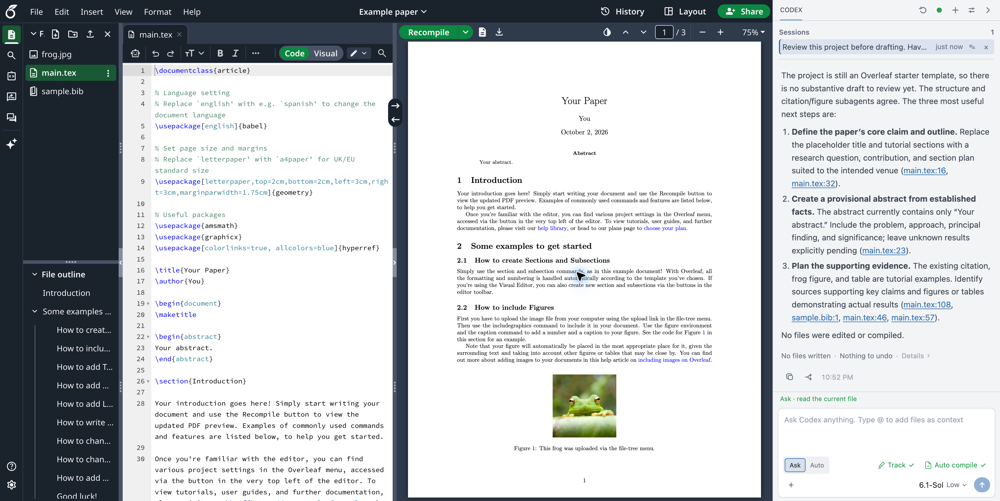
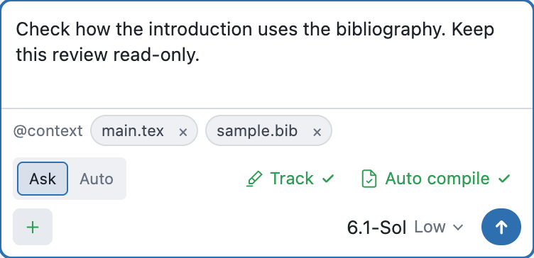
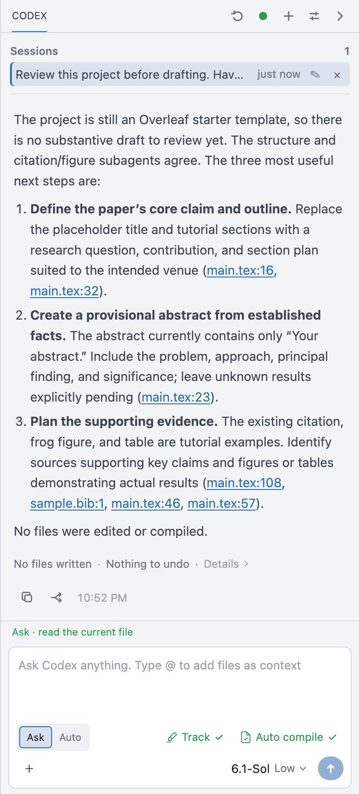
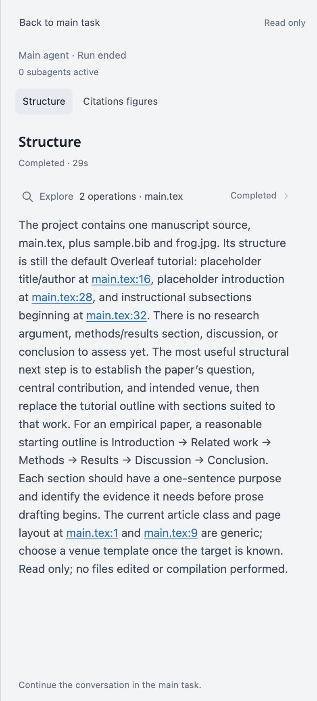
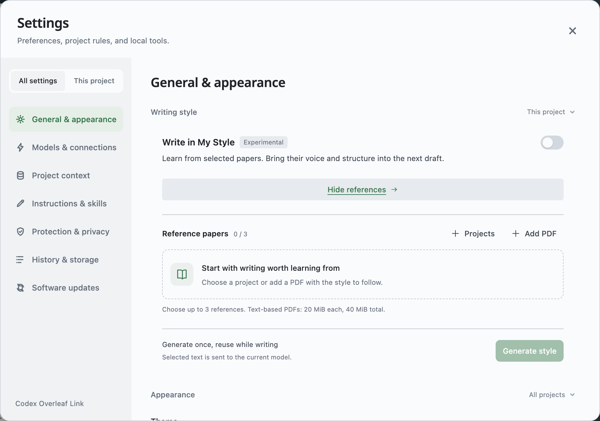
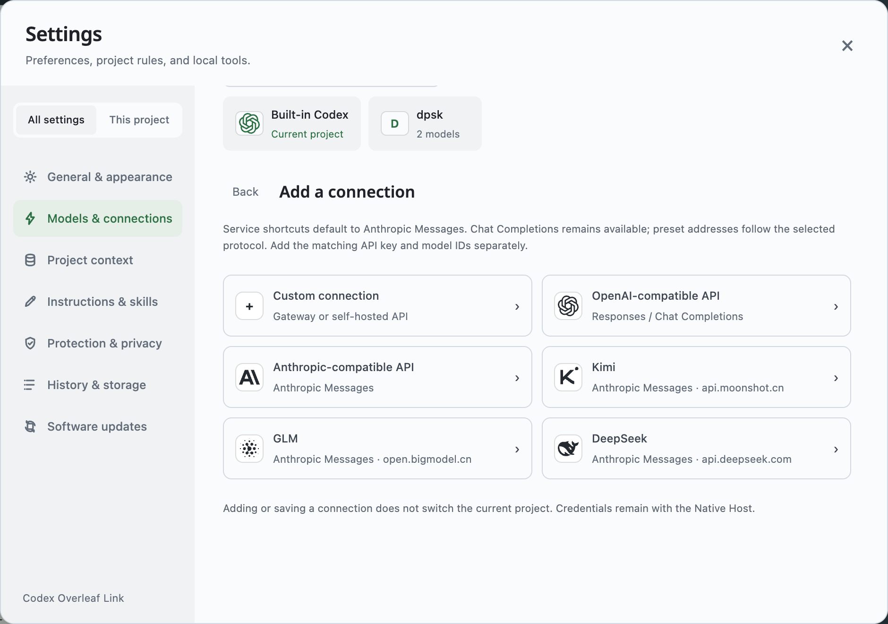
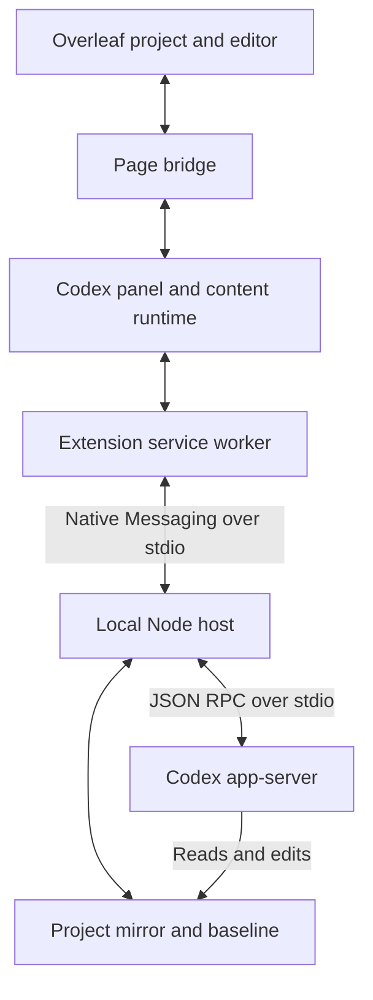

<div align="center">
  
  <h1>Codex Overleaf Link</h1>
  <p><strong>Empower Overleaf with Codex.</strong></p>
  <p></p>
  <p>English | <a href="README.zh-CN.md">简体中文</a></p>
  <p>Chrome · macOS / Windows / Linux · Local Codex</p>
</div>

Ask about the project, revise a passage, and review the result beside the PDF. Codex Overleaf Link brings a local Codex workflow into the Overleaf editor, with project context, model selection, and conversations in one place.



*Actual 2.5.0 interface. A read-only review of the standard Overleaf example project.*

<details>
<summary>Read the conversation detail (native 2x PNG)</summary>

<p align="center"></p>

</details>


[Quick start](#quick-start) · [Writing workflow](#workflow) · [Writing style](#writing-style) · [Models](#connections) · [Detailed reference](#reference)

<a id="workflow"></a>

## Read, revise, and review in one workspace

| Intent | Control | Result |
|---|---|---|
| Understand a section or investigate a problem | **Ask** | An answer grounded in the available project context, without writing to Overleaf. |
| Make a change to the paper | **Auto** | Changes are written back to the project and shown in the run record. |
| Review edits in Overleaf | **Auto + Track** | Text edits appear as Overleaf tracked changes. |
| Reverse a run | **Undo changes** | Eligible edits are restored and eligible newly created files are removed. |

Undo also works after refresh. If a file was edited again afterwards, that file stays available for review; completed Undo steps are retained so a retry can focus on the remaining work.

### Give the conversation the right context

Use `@` or **＋** to attach project files, add `@compile-log` for a compile issue, or select text in the editor. **Add to Chat** provides context; **Edit Selection** sets the requested edit range. PDFs and images can be attached to the composer as references.

<p align="center"></p>

*An unsent draft with two project files attached. File context remains visible in the composer.*

### Follow the work and open a subagent's conversation

A run keeps its activity and result together. Expand its timeline to inspect reads, commands, and edits. With **Parallel Subagents** enabled, the main agent can continue working while delegated readers or workers run alongside it. Open a worker card to read that conversation, then return to the main task.

<table>
  <tr>
    <td width="50%" align="center"></td>
    <td width="50%" align="center"></td>
  </tr>
</table>

*The same real task, shown as an activity view and as a child conversation. These captures show completed workers. Parallel Subagents is experimental.*

<a id="writing-style"></a>

## Write in My Style <sub>Experimental</sub>

Build a reusable writing-style skill from selected Overleaf projects and PDFs.

1. Open **Settings → General & appearance → Writing style**.
2. Choose references from projects or add text-based PDFs.
3. Generate the style, then enable it for the project. Add or change references and use **Update style** to refresh the skill.

The skill is intended to guide phrasing, rhythm, organization, and tone. Reference material supports the writing style; the current task supplies the paper's facts, results, and citations.



*Reference selection and generation controls. No private writing samples are shown.*

<a id="connections"></a>

## Bring the model that fits

Use the local Codex CLI's model catalog, choose a reasoning level in the composer, or configure a compatible provider in **Settings → Models & connections**.

Connection shortcuts cover OpenAI-compatible and Anthropic-compatible APIs, Kimi, GLM, and DeepSeek. A shortcut fills connection defaults; the API key and accepted model IDs are still supplied separately. Third-party providers are experimental.



*Actual connection setup. No API keys are visible.*

<a id="quick-start"></a>

## Quick start

> **Upgrading from an older version**
>
> **Versions earlier than 2.5.0 require a manual update to 2.5.0.** The in-extension **Update now** action cannot perform this upgrade. Run the installation command below, reload the extension in `chrome://extensions`, then refresh the Overleaf page.

**Prerequisites:** Chrome, Node.js 20+, and an installed, signed-in Codex CLI. Source installation also uses Git.

```bash
npm exec --yes codex-overleaf-link@2.5.0 -- install-managed
```

1. Run the managed installer. It prints the extension directory.
2. In `chrome://extensions`, enable **Developer mode**, choose **Load unpacked**, and select that directory.
3. Open an Overleaf project and start with **Ask**. Switch to **Auto** when a file change is intended.

The extension supports project pages on `overleaf.com`, `www.overleaf.com`, and `cn.overleaf.com`.

<a id="reference"></a>

## Setup and reference

Detailed installation, upgrade, privacy, troubleshooting, and development instructions are available below.

<details>
<summary><strong>Open the detailed reference</strong></summary>

## What you need

| | |
|---|---|
| Computer | macOS, Windows, or Linux |
| Browser | Google Chrome. Linux Chromium also works; see [Browser support](#browser-support). |
| Node.js 20+ and Git | Used by the installers and the local bridge |
| [Codex CLI](https://github.com/openai/codex) | Installed and signed in. Check with `codex --version`. |
| Overleaf | An account on `overleaf.com` or `cn.overleaf.com` |
| TeX *(optional)* | Only for local `latexmk` checks |

## Install

There are two pieces: a small local program, the **native host**, that runs Codex on your machine, and the **Chrome extension** that draws the panel. The installers set up both as a matched pair that can update itself later.

Chrome does not let scripts load an extension for you, so every route ends with one short manual step in `chrome://extensions`.

### Option A: Let Codex install it (recommended)

If you already use Codex in a terminal on the computer where Chrome runs, give it this prompt:

```text
Install Codex Overleaf Link from https://github.com/Ghqqqq/codex-overleaf-link on this computer.

Read the official README and installation scripts first. Detect the operating system and check Node.js >= 20, Codex CLI, and any other prerequisites required by the selected installation method.
Use the latest published stable GitHub release, excluding drafts and prereleases, unless a specific version was requested. Use the documented managed installation method and install matching Extension and Native Host versions; do not substitute an unreleased main checkout.
Reuse the existing Chrome profile and managed installation when available. Preserve project files, session history, settings, and provider credentials. Do not print secrets or remove an existing installation without approval.
Complete the terminal-side setup and checks. If Chrome requires a manual Load unpacked or Reload action, provide the exact managed extension folder and the remaining steps; do not bypass browser restrictions.
Report the chosen release, installed Extension and Native Host versions, the browser-loaded version when observable, and the native connection check. Matching on-disk versions alone do not prove Chrome has loaded the update. Clearly identify anything still requiring manual action.
```

### Option B: One-line installer

macOS / Linux:

```bash
CODEX_OVERLEAF_REF=v2.5.0 bash -c "$(curl -fsSL https://raw.githubusercontent.com/Ghqqqq/codex-overleaf-link/v2.5.0/install.sh)"
```

Windows PowerShell:

```powershell
iwr https://raw.githubusercontent.com/Ghqqqq/codex-overleaf-link/v2.5.0/install.ps1 -OutFile install.ps1
$env:CODEX_OVERLEAF_REF='v2.5.0'
powershell -ExecutionPolicy Bypass -File install.ps1
```

The script checks the prerequisites, builds the extension, installs the native host, and prints the folder Chrome should load. On macOS it also copies that path and opens Chrome's extensions page. On macOS and Linux it leaves a `~/Codex Overleaf Link Extension` shortcut in your home folder.

### Option C: npm

```bash
npm exec --yes codex-overleaf-link@2.5.0 -- install-managed
```

Same result as Option B, without keeping a source checkout around.

### Finish in Chrome

1. Open `chrome://extensions` and turn on **Developer mode**.
2. Click **Load unpacked** and choose the folder the installer printed.
3. Open or refresh an Overleaf project. The panel appears on the right.

If an older copy is still loaded from a different folder, remove it so Chrome doesn't show two.

The official build carries a bundled extension key, so it always gets the same stable id and you never need `--extension-id`. Custom builds are covered under [Extension ID](#extension-id).

<details>
<summary><strong>Manual checkout install</strong> (custom location)</summary>

```bash
git clone https://github.com/Ghqqqq/codex-overleaf-link.git
cd codex-overleaf-link
npm ci
npm run build:content
npm run install:native
```

Then load `extension/` as an unpacked extension in Chrome. This install is unmanaged: rebuild and reload the extension after changes, and rerun `npm run install:native` after changing the native runtime. If Chrome assigns a different extension id, rerun `npm run install:native -- --extension-id <chrome-extension-id>`.

</details>

## Your first run

1. Open a project and click the Codex edge tab if the panel is hidden. The header turns green once the native host is connected.
2. Leave the mode on **Ask** and try something that reads the project: *"Summarise what each chapter argues, in one sentence each."*
3. When you want edits, switch to **Auto**, describe the change, and send. Codex edits its local copy, then the extension writes the changes into Overleaf and recompiles if **Compile** is on.
4. Check the result under the answer. The summary line says what was written and whether it can be undone; the file rows show the actual changes.

The run header tells you what is happening at each moment: reading the project, starting Codex, waiting for the model's first reply, then thinking and editing. If something needs your attention, such as a skipped file or a save Overleaf hasn't confirmed yet, the details open by themselves.

## Ask, Auto and Track

| | What Codex may do | Where the changes go |
|---|---|---|
| **Ask** | Read and analyse | Nowhere. Overleaf is not touched. |
| **Auto** | Read and edit | Written straight into Overleaf in Editing mode. |
| **Auto + Track** | Read and edit | Written as tracked changes you can review in Overleaf's Review panel. |

Auto does not stop for per-hunk approval, but deleting files and creating or replacing images and PDFs always ask first. Before each write the extension checks that the text it is about to change still matches what Codex saw. If a collaborator edited the same lines in the meantime, that file is skipped and reported, never overwritten.

**Undo changes** puts the run's files back the way they were, created files included, and works after a page reload. If someone edited the same text afterwards, Undo stops for that file instead of guessing.

**Accept changes** finalises a Track run's changes in one step and leaves Overleaf in Editing mode.

> [!WARNING]
> Don't use the run card's **Accept changes** when the same files contain unrelated tracked changes from collaborators or other runs. Accept those individually in Overleaf's Review panel instead.

**Cancel** stops the run. Anything already written stays, and the card shows which parts landed so you can undo them.

## Models and API providers

By default the panel uses your local Codex CLI: its login, models and settings. Pick a model and reasoning level from the control in the composer.

To use another endpoint, open **Project Settings → Model providers → Configure → Add provider**:

1. Enter a **Provider name**, the **Base URL** and your **API key**. HTTPS is required except for localhost.
2. Under **Models**, add each model with the exact ID your endpoint accepts, and mark one as the default.
3. Leave **API protocol** on Auto, or pick Responses API, Chat Completions or Anthropic Messages. If the URL already ends with the full endpoint path, tick **Base URL is the full protocol endpoint**.
4. **Test connection** sends one real request to a model you pick. Then choose **Save and use for this project**.

The choice applies to every session in the current project; other projects keep their own. Switching keeps your history and starts fresh threads for new turns. Gateways differ in how they handle tools and reasoning, so a passing test doesn't guarantee every model behaves the same in long tasks. API keys stay with the native host on your machine; task context is sent to the endpoint you chose.

## Context and attachments

- **Files**: type `@` or use the **＋** tray to add up to five files. They stay selected across turns until you clear them. Codex can still read the rest of the project.
- **Selections**: select text in the editor and attach it as context, or as **Selection only** to restrict the edit to that range. The chip stays visible on the message you sent.
- **Compile log**: `@compile-log` attaches the current errors and warnings.
- **Attachments**: paste or drop PDFs and images into the composer. Up to 8 per turn, 12 MiB each and 32 MiB in total. They are only for Codex to read and are never written to Overleaf.
- **Generated files**: images, PDFs and other assets Codex creates (up to 10 MiB each) ask for confirmation before they're added to the project. LaTeX build output is filtered out.

## Updating

Managed installs check GitHub for new signed stable releases on their own. When one is available, choose **Update now** in the notice or under **Settings → Software updates**. The update waits until every Overleaf tab is saved and no task is running, replaces the extension and native host together, and restores the previous version if the new one fails its health check. Drafts and prereleases are never picked up, and an update never adds Chrome permissions silently.

The updater respects HTTP(S) proxy environment variables and the macOS/Windows system proxy. SOCKS-only or PAC-only setups need an HTTP proxy endpoint.

### Coming from v2.4.x or earlier

v2.5.0 adds `cn.overleaf.com` support, which needs a new Chrome permission, so it moves the install to Bootstrap protocol 3. Older updaters refuse that step by design rather than granting permissions themselves. **Update now will not work for this one release.** Run the installer once:

```bash
npm exec --yes codex-overleaf-link@2.5.0 -- install-managed
```

Then click **Reload** on the extension in `chrome://extensions` and refresh Overleaf. Your sessions, settings, provider keys and project mirrors are kept. Later releases update in place again.

From v2.5.0 on, a release that ever needs another reinstall is announced in the panel as **Reinstall needed for this update**, with the reason, the exact command for that version, and a copy button, instead of a failed update. New Overleaf sites no longer need a reinstall at all: the extension popup asks you to allow the site, and Chrome confirms it.

Checkout and Release-zip installs are unmanaged and always update by hand.

## Commands

| Action | Command |
|---|---|
| Install, repair or migrate | `npm exec --yes codex-overleaf-link@2.5.0 -- install-managed` |
| Diagnose | `npm exec --yes codex-overleaf-link@2.5.0 -- doctor` |
| Uninstall | `npm exec --yes codex-overleaf-link@2.5.0 -- uninstall-managed` |

npm installs, updates, and uninstalls the coordinated managed extension/native pair. The legacy `install-native` command remains available only for explicitly unmanaged extension directories:

```bash
npm exec --yes codex-overleaf-link@2.5.0 -- install-native
```

Use `--extension-id <chrome-extension-id>` only for a custom/dev unpacked extension id that differs from the official bundled id. On Linux Chromium, add `--browser chromium` to any of these.

<a id="uninstall"></a>
<details>
<summary><strong>Uninstall</strong></summary>

```bash
npm exec --yes codex-overleaf-link@2.5.0 -- uninstall-managed
```

This works in PowerShell too, and also removes installs made by `install.sh` / `install.ps1`. For an unmanaged checkout or native-only install, run `npm run uninstall:native` from the checkout, or:

```bash
npm exec --yes codex-overleaf-link@2.5.0 -- uninstall-native
```

An older native-only source install can also be removed with its bundled uninstaller:

```bash
node ~/.codex-overleaf/source/scripts/uninstall-native-host.mjs
```

```powershell
node "$env:LOCALAPPDATA\CodexOverleaf\source\scripts\uninstall-native-host.mjs"
```

Uninstalling removes the native host registration, bridge, managed extension and runtimes. It leaves your history, settings, project mirrors, provider keys and skills alone. Remove the extension from `chrome://extensions` as well. On Windows the install lives under `%LOCALAPPDATA%\CodexOverleaf` and your data under `%USERPROFILE%\.codex-overleaf`, so a full cleanup covers both. See [Local data and cleanup](#local-data-and-cleanup).

</details>

## FAQ and troubleshooting

**The panel says "Native host update required", or can't find the native host.**
Rerun the installer, reload the extension in `chrome://extensions`, then refresh Overleaf:

```bash
npm exec --yes codex-overleaf-link@2.5.0 -- install-managed
```

For a checkout install, rebuild and rerun `npm run install:native` from the same checkout.

**Codex CLI not found.**
Make sure `codex --version` works in a new terminal (on Windows, `Get-Command codex`), and that you're signed in for the built-in provider. Then rerun the installer so the launcher picks up your PATH.

**Extension id mismatch.**
Copy the id from `chrome://extensions` and reinstall with it. See [Extension ID](#extension-id).

**A file was skipped.**
Usually a collaborator changed those lines, the file couldn't be opened in the editor in time, or a project rule marks it read-only. The details under the answer say which, and **Retry sync** writes only the files that are still pending. Don't rerun the whole task just to retry. That can apply the same edit twice.

**Undo changes or Accept changes is missing.**
Both depend on what the run actually wrote. If files were written but the button is gone, check the changes in Overleaf before doing anything else, and attach exported diagnostics to an issue.

**A write was blocked by a project rule, or the sensitive-content check fired.**
Rules can make paths read-only or restrict where Codex may write. Adjust them in Project Settings or narrow the request. The sensitive-content check looks for things like tokens and keys before context leaves your machine; remove or redact what it found.

**A queued message or a fork won't run.**
Queued messages keep the settings they were sent with. If that provider profile was changed or deleted, send the message again. A fork needs a recorded Codex turn and is disabled when there isn't one.

**Reporting a bug.**
Use **Export Diagnostics** in the panel. The bundle leaves out project text, prompts, compile logs, diffs and secrets by default. If you attach other logs, check them for file names, tokens and document text first.

## How it works


```mermaid
flowchart TD
    O[Overleaf project and editor] <--> P[Page bridge]
    P <--> C[Codex panel and content runtime]
    C <--> B[Extension service worker]
    B <-->|Native Messaging over stdio| N[Local Node host]
    N <--> M[Project mirror and baseline]
    N <-->|JSON RPC over stdio| A[Codex app-server]
    A -->|Reads and edits| M
```

1. When you send a task, the extension captures your settings and syncs the Overleaf project into a local mirror, or reuses the mirror if it's still current.
2. The native host starts `codex app-server` against that mirror with an isolated Codex home, so plugin runs don't mix with your own Codex sessions.
3. When Codex finishes, the host compares the mirror with its baseline and turns the differences into text patches and asset transfers. Ask stops here.
4. In Auto, the extension writes each patch through the Overleaf editor after checking the project, path rules, edit mode and the expected text. Anything that doesn't line up is skipped and reported.
5. The undo point is recorded before any further step, then the save state is verified, the mirror refreshed and, if enabled, the project recompiled.

## Development

```bash
npm ci
npm run build:content
npm test
npm run verify:source
npm run verify:npm-package
npm run verify:update-boundary
npm run check:architecture
npm run benchmark:large
```

There are no npm runtime dependencies. Development uses a pinned **esbuild**; the Markdown and math libraries are vendored into the extension. Tests use Node's built-in runner, including VM-based browser integration tests. [CI](.github/workflows/test.yml) runs on macOS, Ubuntu and Windows with Node 24.18.0 and rehearses the managed-update hop on Ubuntu.

The content script is bundled from [content-entry.mjs](extension/entries/content-entry.mjs). Edit the modules, run `npm run build:content`, and reload the extension. To push a local build into an existing managed install, run `npm run install:managed`, then reload the extension and Overleaf. `npm run bridge` starts the native host on stdio for protocol work.

| Area | Entry points |
|---|---|
| Panel and task orchestration | `extension/src/content/contentRuntime.js`, `extension/src/content/runController.js` |
| Page snapshot and writeback | `extension/src/pageBridge.js`, `extension/src/page/snapshotRouter.js`, `extension/src/page/writebackRouter.js` |
| Browser/native transport | `extension/src/background.js`, `native-host/src/index.js` |
| Codex and local mirror | `native-host/src/taskRunnerRuntime.js`, `native-host/src/codexSessionRunner.js`, `native-host/src/mirrorWorkspace.js` |
| Shared contracts and persistence | `extension/src/shared/`, `extension/src/content/scopedPersistenceCoordinator.js` |
| Managed updates and packaging | `extension/bootstrap/`, `extension/src/backgroundUpdateCoordinator.js`, `native-host/src/updateManager.js`, `scripts/` |

Browser smoke test against a real project:

```bash
npm run smoke:extension -- --url 'https://www.overleaf.com/project/<project-id>' --probe panel,native,project,diagnostics --json .local/smoke.json
```

It launches Chrome with a temporary profile by default. Use `--profile-dir <test-profile-dir> --keep-profile` for a profile that's already signed in to Overleaf. For releases, see `npm run build:release`, `npm run verify:release-artifacts` and `npm run rehearse:update-hop`.

## Browser support

| Platform | Browser | Notes |
|---|---|---|
| macOS | Google Chrome | Default installer |
| Windows | Google Chrome | PowerShell installer |
| Linux | Google Chrome | Default installer |
| Linux | Chromium | Add `--browser chromium` when installing or uninstalling |

Chromium on macOS and Windows isn't supported yet. The extension runs on project pages of `overleaf.com`, `www.overleaf.com` and `cn.overleaf.com`; self-hosted Overleaf isn't covered.

Linux Chromium:

```bash
CODEX_OVERLEAF_REF=v2.5.0 bash -c "$(curl -fsSL https://raw.githubusercontent.com/Ghqqqq/codex-overleaf-link/v2.5.0/install.sh)" -- --browser chromium
npm exec --yes codex-overleaf-link@2.5.0 -- uninstall-managed --browser chromium
```

## Extension ID

The repo ships a fixed extension key, so the official build always gets this id:

```
illdpneeeopfffmiepaejglgmhpmdhdc
```

If you load a custom build and Chrome gives it a different id, reinstall with that id so the native host's `allowed_origins` matches:

```bash
npm exec --yes codex-overleaf-link@2.5.0 -- install-managed --extension-id "<your-chrome-extension-id>"
```

For an unmanaged extension, use `install-native --extension-id "<your-chrome-extension-id>"` instead. The source installers also read `CODEX_OVERLEAF_EXTENSION_ID`.

## Release artifacts

Each GitHub Release includes:

- `codex-overleaf-link-extension-v2.5.0.zip`: the extension, for manual unpacked installation.
- `codex-overleaf-native-host-v2.5.0.tar.gz`: the native host runtime used by the installers.
- `codex-overleaf-update-v2.5.0.tar.gz`: the combined bundle the in-product updater downloads.
- `codex-overleaf-link-2.5.0.tgz`: the npm package behind the `npm exec` commands.
- `install.sh` and `install.ps1`: installers pinned to this release.
- `uninstall-native-host.mjs` plus its helpers `nativeHostPlatform.js`, `manifest.js` and `runtimeInstaller.js`.
- `SHA256SUMS`, `release-manifest.json` and `release-manifest.sig`: checksums and the Ed25519-signed release metadata the updater verifies.
- `release-notes.md`.

## Local data and cleanup

There is no hosted backend and no telemetry. Everything below lives on your machine. During a run, task context is sent to Codex or to the provider you configured. Project rules control what may be written; they don't hide files from the model.

| What | Where (macOS/Linux; Windows in brackets) |
|---|---|
| Sessions, runs, history | IndexedDB database `codex-overleaf` under the Overleaf site in Chrome |
| Preferences and project settings | `chrome.storage.local` of the extension |
| Managed extension | `~/.codex-overleaf/managed/extension` (`%LOCALAPPDATA%\CodexOverleaf\managed\extension`) |
| Managed native host | `~/.codex-overleaf/managed/native` (`%LOCALAPPDATA%\CodexOverleaf\managed\native`) |
| Installer checkout | `~/.codex-overleaf/source` (`%LOCALAPPDATA%\CodexOverleaf\source`) |
| Native bridge | `~/.codex-overleaf/codex-overleaf-bridge` (`%LOCALAPPDATA%\CodexOverleaf\codex-overleaf-bridge.cmd`) |
| Project mirrors | `~/.codex-overleaf/projects` (`%USERPROFILE%\.codex-overleaf\projects`) |
| Plugin Codex home | `~/.codex-overleaf/codex-home` (`%USERPROFILE%\.codex-overleaf\codex-home`) |
| Codex Overleaf skills | `~/.codex-overleaf/skills` (`%USERPROFILE%\.codex-overleaf\skills`) |
| Provider profiles and keys | `~/.codex-overleaf/providers.json`, `provider-secrets.json` (`%USERPROFILE%\.codex-overleaf`) |
| Logs | `~/.codex-overleaf/native-host.log`, `native-host-launcher.log` (`%LOCALAPPDATA%\CodexOverleaf\native-host.log`) |

The history database belongs to the Overleaf page, not to the extension, so removing the extension does not erase it. See Chrome's notes on [content-script storage](https://developer.chrome.com/docs/extensions/develop/concepts/storage-and-cookies#storage).

The plugin's Codex home copies your login and config but not your personalisation: no `~/.codex/AGENTS.md`, no top-level `personality` key, no global `rules` or `memories`. Skill loading toggles default to enabled, and both live in Settings:

- `Load local Codex skills` brings your own skills and plugins (`~/.codex/skills`, local Codex `plugins`, `superpowers` and related configuration) into the isolated `~/.codex-overleaf/codex-home`. It only affects that plugin home and does not write to or reuse global `~/.codex/sessions`.
- `Load Codex Overleaf skills` loads the skills this extension manages from `~/.codex-overleaf/skills` (`%USERPROFILE%\.codex-overleaf\skills` on Windows). Turning it off hides them without deleting the files.

Native Messaging registration:

| Platform | Path |
|---|---|
| macOS Chrome | `~/Library/Application Support/Google/Chrome/NativeMessagingHosts/com.codex.overleaf.json` |
| Linux Chrome | `~/.config/google-chrome/NativeMessagingHosts/com.codex.overleaf.json` |
| Linux Chromium | `~/.config/chromium/NativeMessagingHosts/com.codex.overleaf.json` |
| Windows Chrome | `HKCU\Software\Google\Chrome\NativeMessagingHosts\com.codex.overleaf` → `%LOCALAPPDATA%\CodexOverleaf\native-host-runtime\com.codex.overleaf.json` |

To remove everything:

1. While the extension is still installed, use **Settings → History & storage → Clear local history…** in each Chrome profile you used. If it's already gone, delete the `codex-overleaf` database from the Overleaf page's **DevTools → Application → IndexedDB**.
2. Run `uninstall-managed` (or `uninstall-native` for an unmanaged install). See [Uninstall](#uninstall).
3. Remove the extension in `chrome://extensions`. Chrome clears its `chrome.storage.local` with it.
4. Delete the local folders. **This permanently removes mirrors, plugin history, provider keys and skills.**

```bash
rm -rf ~/.codex-overleaf ~/Codex\ Overleaf\ Link\ Extension
```

```powershell
Remove-Item -Recurse -Force "$env:LOCALAPPDATA\CodexOverleaf", "$env:USERPROFILE\.codex-overleaf" -ErrorAction SilentlyContinue
```

## Contributing

Issues and pull requests are welcome. For larger changes, open an issue first so we can talk through the approach. Run `npm test` before submitting, and keep [README.md](README.md) and [README.zh-CN.md](README.zh-CN.md) in step when behaviour, versions or commands change.

## License

[MIT](LICENSE)

<p align="center"><strong>English</strong> | <a href="README.zh-CN.md" lang="zh-CN">简体中文</a></p>


</details>
