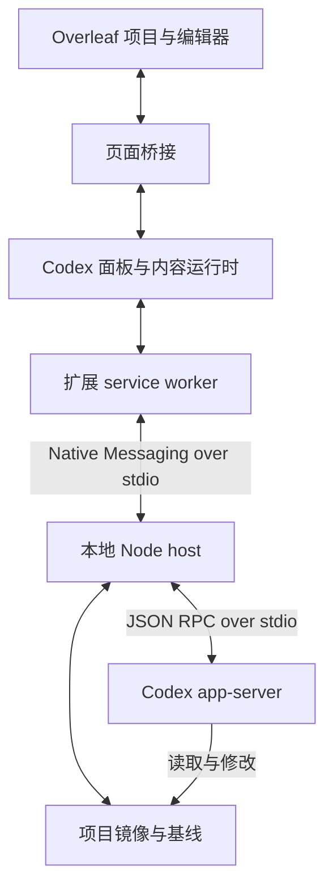

<div align="center">
  
  <h1>Codex Overleaf Link</h1>
  <p><strong>Empower Overleaf with Codex.</strong></p>
  <p></p>
  <p><a href="README.md">English</a> | 简体中文</p>
  <p>Chrome · macOS / Windows / Linux · 本地 Codex</p>
  <p>
    
    
    
    <a href="https://github.com/Ghqqqq/codex-overleaf-link/actions/workflows/test.yml"></a>
    
    
  </p>
</div>

理解项目、修改段落、对照 PDF 查看结果。Codex Overleaf Link 把本地 Codex 工作流带进 Overleaf 编辑器，让项目上下文、模型选择和写作对话留在同一个工作区。


*2.5.0 当前界面实拍，展示对 Overleaf 默认示例项目的一次只读导览。*

<details>
<summary>展开对话细节（原生 2× PNG）</summary>

<p align="center"></p>

</details>


[快速开始](#quick-start) · [写作流程](#workflow) · [写作风格](#writing-style) · [模型连接](#connections) · [详细文档](#reference)

<a id="workflow"></a>

## 阅读、修改、审阅，在同一个工作区完成

| 需要完成的事 | 使用方式 | 结果 |
|---|---|---|
| 理解章节或定位问题 | **Ask** | 结合可用的项目上下文回答，不向 Overleaf 写入。 |
| 修改论文内容 | **Auto** | 改动写回项目，并在本轮记录中展示。 |
| 在 Overleaf 中审阅修改 | **Auto + Track** | 文本修改以留痕形式进入 Overleaf 审阅面板。 |
| 撤回某一轮修改 | **Undo changes** | 恢复符合条件的修改，移除符合条件的新建文件。 |

撤销在刷新后仍可继续。如果文件随后又被改动，该文件会保留供进一步处理；已经完成的撤销步骤会被记住，重试只处理剩余内容。

### 让对话带上合适的上下文

通过 `@` 或 **＋** 添加项目文件，用 `@compile-log` 引用编译问题，也可以直接选中编辑器里的文字。**Add to Chat** 把选区加入上下文；**Edit Selection** 指定本次修改范围。PDF 和图片也可以作为参考附在输入框中。

<p align="center"></p>

*尚未发送的草稿，已附加两个项目文件。上下文条目直接显示在输入框中。*

### 看清执行过程，也能进入子代理对话

每一轮对话保留运行记录和最终结果。展开时间线，可以查看读取、命令与修改。启用 **Parallel Subagents** 后，主 agent 可以在子代理执行期间继续工作；点击子任务卡片即可查看对应对话，再返回主任务。

<table>
  <tr>
    <td width="50%" align="center"></td>
    <td width="50%" align="center"></td>
  </tr>
</table>

*同一次真实任务的运行记录与子对话。图中子任务已经完成；并行子代理目前属于实验功能。*

<a id="writing-style"></a>

## Write in My Style <sub>实验功能</sub>

从选定的 Overleaf 项目与 PDF 中提取写作习惯，生成可复用的写作风格 skill。

1. 打开 **Settings → General & appearance → Writing style**。
2. 选择参考项目，或加入可提取文本的 PDF。
3. 生成风格后为当前项目启用；参考资料变化后，通过 **Update style** 更新已有 skill。

风格 skill 用于指导措辞、句式节奏、组织方式和语气。参考资料提供风格依据，当前写作任务提供论文的事实、结果与引用。


*参考资料选择与风格生成入口，截图未包含私人写作样本。*

<a id="connections"></a>

## 选择合适的模型与连接方式

默认使用本机 Codex CLI 的模型目录，在输入框中选择模型与推理强度。需要其他接口时，打开 **Settings → Models & connections**。

快捷入口覆盖 OpenAI 兼容接口、Anthropic 兼容接口，以及 Kimi、GLM 和 DeepSeek。快捷入口预填连接默认值，API 密钥和模型 ID 仍需单独填写。第三方模型服务目前属于实验功能。


*连接配置界面实拍，没有展示 API 密钥。*

<a id="quick-start"></a>

## 快速开始

> **从旧版本升级**
>
> **2.5.0 之前的版本需要手动更新到 2.5.0。** 本次升级无法通过插件内的“立即更新”完成。运行下方安装命令后，在 `chrome://extensions` 中重新加载扩展，并刷新 Overleaf 页面。

**准备条件：** Chrome、Node.js 20+，以及已安装并登录的 Codex CLI。源码安装还需要 Git。

```bash
npm exec --yes codex-overleaf-link@2.5.0 -- install-managed
```

1. 运行托管安装命令，取得安装器输出的扩展目录。
2. 在 `chrome://extensions` 开启**开发者模式**，点击**加载已解压的扩展程序**并选择该目录。
3. 打开 Overleaf 项目，先用 **Ask** 阅读和提问；需要改文件时切换到 **Auto**。

支持 `overleaf.com`、`www.overleaf.com` 和 `cn.overleaf.com` 的项目页面。

<a id="reference"></a>

## 安装与维护参考

完整的安装、升级、隐私、排障和开发说明见下文。

<details>
<summary><strong>展开详细文档</strong></summary>

## 需要准备

| | |
|---|---|
| 电脑 | macOS、Windows 或 Linux |
| 浏览器 | Google Chrome。Linux 上的 Chromium 也可以，见[浏览器支持](#浏览器支持)。 |
| Node.js 20+ 和 Git | 安装器和本地桥接程序会用到 |
| [Codex CLI](https://github.com/openai/codex) | 已安装并登录，可用 `codex --version` 检查 |
| Overleaf | `overleaf.com` 或 `cn.overleaf.com` 账号 |
| TeX *（可选）* | 只在本地 `latexmk` 检查时需要 |

## 安装

插件由两部分组成：一个在本机运行 Codex 的小程序（**native host**），和负责显示面板的 **Chrome 扩展**。安装器会把两者作为配套的一对装好，之后可以自动更新。

Chrome 不允许脚本替你加载扩展，所以无论哪种方式，最后都要在 `chrome://extensions` 里手动点一下。

### 方式 A：让 Codex 安装（推荐）

如果你已经在 Chrome 所在的电脑上用终端里的 Codex，把下面这段话发给它：

```text
Install Codex Overleaf Link from https://github.com/Ghqqqq/codex-overleaf-link on this computer.

Read the official README and installation scripts first. Detect the operating system and check Node.js >= 20, Codex CLI, and any other prerequisites required by the selected installation method.
Use the latest published stable GitHub release, excluding drafts and prereleases, unless a specific version was requested. Use the documented managed installation method and install matching Extension and Native Host versions; do not substitute an unreleased main checkout.
Reuse the existing Chrome profile and managed installation when available. Preserve project files, session history, settings, and provider credentials. Do not print secrets or remove an existing installation without approval.
Complete the terminal-side setup and checks. If Chrome requires a manual Load unpacked or Reload action, provide the exact managed extension folder and the remaining steps; do not bypass browser restrictions.
Report the chosen release, installed Extension and Native Host versions, the browser-loaded version when observable, and the native connection check. Matching on-disk versions alone do not prove Chrome has loaded the update. Clearly identify anything still requiring manual action.
```

### 方式 B：一行命令安装

macOS / Linux：

```bash
CODEX_OVERLEAF_REF=v2.5.0 bash -c "$(curl -fsSL https://raw.githubusercontent.com/Ghqqqq/codex-overleaf-link/v2.5.0/install.sh)"
```

Windows PowerShell：

```powershell
iwr https://raw.githubusercontent.com/Ghqqqq/codex-overleaf-link/v2.5.0/install.ps1 -OutFile install.ps1
$env:CODEX_OVERLEAF_REF='v2.5.0'
powershell -ExecutionPolicy Bypass -File install.ps1
```

脚本会检查环境、构建扩展、安装 native host，最后打印 Chrome 需要加载的文件夹。macOS 上还会自动复制这个路径并打开 Chrome 扩展页；macOS 和 Linux 上会在主目录留一个 `~/Codex Overleaf Link Extension` 快捷方式。

### 方式 C：npm

```bash
npm exec --yes codex-overleaf-link@2.5.0 -- install-managed
```

效果和方式 B 一样，只是不用保留源码目录。

### 在 Chrome 里完成

1. 打开 `chrome://extensions`，打开右上角的**开发者模式**。
2. 点**加载已解压的扩展程序**，选择安装器打印的那个文件夹。
3. 打开或刷新一个 Overleaf 项目，面板会出现在右侧。

如果之前从别的文件夹加载过旧版本，把旧的删掉，免得 Chrome 里出现两个。

官方构建自带固定的扩展 key，扩展 id 永远不变，不需要 `--extension-id`。自己构建的版本见[扩展 ID](#扩展-id)。

<details>
<summary><strong>手动从源码安装</strong>（自定义位置）</summary>

```bash
git clone https://github.com/Ghqqqq/codex-overleaf-link.git
cd codex-overleaf-link
npm ci
npm run build:content
npm run install:native
```

然后在 Chrome 里把 `extension/` 作为已解压扩展加载。这种安装不受托管：改了代码要自己重新构建并重新加载扩展，改了 native 运行时要重新执行 `npm run install:native`。如果 Chrome 分配了不同的扩展 id，执行 `npm run install:native -- --extension-id <chrome-extension-id>`。

</details>

## 第一次使用

1. 打开一个项目。如果面板没显示，点页面边缘的 Codex 标签。native host 连上后，标题栏会变绿。
2. 模式保持 **Ask**，先试一个只读的问题：*“用一句话概括每一章的论点。”*
3. 想让它动手改时，切到 **Auto**，描述要改什么，然后发送。Codex 先改本地副本，扩展再把改动写进 Overleaf；如果开着 **Compile**，还会自动重新编译。
4. 在回答下面看结果。摘要行写明写入了什么、能不能撤销；文件行里是具体改动。

标题行会实时说明当前在做什么：读取项目、启动 Codex、等待模型首次响应，然后是思考和修改。遇到需要你处理的情况，比如有文件被跳过、Overleaf 还没确认保存，详情会自动展开。

## Ask、Auto 和 Track

| | Codex 能做什么 | 改动去哪里 |
|---|---|---|
| **Ask** | 阅读和分析 | 哪里都不去，不碰 Overleaf。 |
| **Auto** | 阅读和修改 | 在编辑模式下直接写进 Overleaf。 |
| **Auto + Track** | 阅读和修改 | 以留痕修改写入，可在 Overleaf 审阅面板里逐条查看。 |

Auto 不会逐段等你确认，但删除文件、新建或替换图片和 PDF 一定会先问你。每次写入前，扩展都会核对要改的那段文字是否还和 Codex 看到的一致。如果合作者在这期间改了同一处，这个文件会被跳过并报告，绝不会被覆盖。

**撤销改动**会把这一轮动过的文件恢复原样，新建的文件也会删掉，刷新页面后照样可用。如果之后有人又改了同一段，撤销会在那个文件上停下来，不会去猜。

**接受改动**会一次性确认 Track 模式下这一轮的全部改动，并让 Overleaf 回到编辑模式。

> [!WARNING]
> 如果同一批文件里还有合作者或其他轮次留下的、无关的留痕修改，不要用运行卡片上的**接受改动**。请到 Overleaf 的审阅面板里逐条处理。

**取消**会停止这一轮。已经写进去的内容会保留，卡片上会标出哪些部分已写入，方便你撤销。

## 模型与 API 服务

默认使用本机 Codex CLI 的登录、模型和配置。在输入框的模型控件里选择模型和推理强度即可。

想换别的接口，打开 **项目设置 → 模型服务 → 配置 → 添加模型服务**：

1. 填写**服务名称**、**基础 URL** 和 **API 密钥**。除 localhost 外必须使用 HTTPS。
2. 在**模型**里逐个添加模型，ID 要和接口接受的完全一致，并把其中一个设为默认。
3. **API 协议**保持自动，或手动选 Responses API、Chat Completions 或 Anthropic Messages。如果 URL 已经是完整的接口路径，勾选**基础 URL 已是完整协议端点**。
4. **测试连接**会对你选的模型真实发一次请求。最后选**保存并用于当前项目**。

这个选择对当前项目的所有会话生效，其他项目各自保留自己的设置。切换后历史保留，新的对话轮次会开新线程。不同网关对工具调用和推理的处理不一样，测试通过不代表每个模型在长任务里表现都相同。API key 只保存在本机 native host 里，任务上下文会发给你选的接口。

## 上下文与附件

- **文件**：输入 `@` 或用 **＋** 面板最多添加五个文件，跨轮次保持选中，直到你清除。Codex 仍然可以读项目里的其他文件。
- **选区**：在编辑器里选中文字，作为上下文附加，或选**仅此处**把修改限制在这段范围内。发出去的消息上也会保留这张选区卡片。
- **编译日志**：`@compile-log` 会附上当前的错误和警告。
- **附件**：把 PDF、图片粘贴或拖进输入框。每轮最多 8 个，单个 12 MiB，总共 32 MiB。附件只给 Codex 阅读，不会写进 Overleaf。
- **生成的文件**：Codex 新建的图片、PDF 等资源（单个不超过 10 MiB）在加入项目前会先请你确认。LaTeX 编译产物会被过滤掉。

## 更新

托管安装会自动去 GitHub 检查新的已签名正式版。有更新时，在提示里或 **设置 → 软件更新** 里点**立即更新**。更新会等所有 Overleaf 标签页都保存好、没有任务在跑时才开始，扩展和 native host 一起替换；新版本健康检查不通过会自动回到旧版本。草稿和预发布版本不会被选中，更新也不会悄悄增加 Chrome 权限。

更新器会使用 HTTP(S) 代理环境变量以及 macOS/Windows 系统代理。只有 SOCKS 或 PAC 的环境需要提供一个 HTTP 代理地址。

### 从 v2.4.x 或更早版本升级

v2.5.0 新增了 `cn.overleaf.com` 支持，需要一项新的 Chrome 权限，因此安装结构升级到了 Bootstrap 协议 3。旧版更新器按设计会拒绝这一步，而不是自己去加权限。**这一版没法通过“立即更新”升级**。请手动运行一次安装：

```bash
npm exec --yes codex-overleaf-link@2.5.0 -- install-managed
```

然后在 `chrome://extensions` 里点扩展的**重新加载**，再刷新 Overleaf。会话、设置、模型服务的 key 和项目镜像都会保留。之后的版本又可以在插件里直接更新。

从 v2.5.0 起，如果以后某个版本又需要重新安装，面板会直接提示“这次更新需要重新安装”，写明原因，给出对应版本的命令和复制按钮，而不是显示更新失败。新增 Overleaf 站点也不再需要重装：扩展弹窗会请你允许访问该站点，Chrome 确认后即可使用。

源码安装和 Release zip 安装不受托管，始终需要手动更新。

## 常用命令

| 操作 | 命令 |
|---|---|
| 安装、修复或迁移 | `npm exec --yes codex-overleaf-link@2.5.0 -- install-managed` |
| 诊断 | `npm exec --yes codex-overleaf-link@2.5.0 -- doctor` |
| 卸载 | `npm exec --yes codex-overleaf-link@2.5.0 -- uninstall-managed` |

npm 负责安装、更新和卸载配套的托管扩展与 native host。旧的 `install-native` 命令只用于明确不受托管的扩展目录：

```bash
npm exec --yes codex-overleaf-link@2.5.0 -- install-native
```

只有自定义或开发版扩展 id 与官方 id 不同时，才需要 `--extension-id <chrome-extension-id>`。Linux Chromium 请在以上命令后加 `--browser chromium`。

<a id="uninstall"></a>
<details>
<summary><strong>卸载</strong></summary>

```bash
npm exec --yes codex-overleaf-link@2.5.0 -- uninstall-managed
```

PowerShell 里同样可用，也能卸载 `install.sh` / `install.ps1` 装的版本。源码安装或只装了 native host 的情况，在源码目录里执行 `npm run uninstall:native`，或者：

```bash
npm exec --yes codex-overleaf-link@2.5.0 -- uninstall-native
```

旧的 native-only 源码安装也可以用它自带的卸载脚本：

```bash
node ~/.codex-overleaf/source/scripts/uninstall-native-host.mjs
```

```powershell
node "$env:LOCALAPPDATA\CodexOverleaf\source\scripts\uninstall-native-host.mjs"
```

卸载会移除 native host 注册、桥接程序、托管扩展和运行时，不会动你的历史、设置、项目镜像、模型服务 key 和 skills。别忘了在 `chrome://extensions` 里把扩展也删掉。Windows 上安装位于 `%LOCALAPPDATA%\CodexOverleaf`，数据位于 `%USERPROFILE%\.codex-overleaf`，彻底清理需要两处都处理。见[本地数据与清理](#本地数据与清理)。

</details>

## 常见问题与故障排查

**面板提示“需要更新 native host”，或找不到 native host。**
重新运行安装器，在 `chrome://extensions` 里重新加载扩展，再刷新 Overleaf：

```bash
npm exec --yes codex-overleaf-link@2.5.0 -- install-managed
```

源码安装请在同一个源码目录里重新构建，并重新执行 `npm run install:native`。

**找不到 Codex CLI。**
确认在新终端里 `codex --version` 能运行（Windows 上用 `Get-Command codex`），使用内置服务时确认已登录。然后重新运行安装器，让启动器拿到新的 PATH。

**扩展 id 不匹配。**
从 `chrome://extensions` 复制 id，用它重新安装。见[扩展 ID](#扩展-id)。

**有文件被跳过。**
通常是合作者改了同一处、编辑器没能及时打开那个文件，或者项目规则把它设成了只读。回答下面的详情会写明原因，**重试同步**只会写入还没完成的文件。不要为了重试而把整个任务再跑一遍，那样可能把同一处改两次。

**撤销或接受按钮不见了。**
这两个按钮取决于这一轮实际写入了什么。如果文件确实写进去了但按钮没了，先到 Overleaf 里核对改动，再导出诊断信息提 issue。

**写入被项目规则拦下，或触发了敏感信息检查。**
规则可以把路径设为只读，或限制 Codex 能写的位置，可以在项目设置里调整，或缩小请求范围。敏感信息检查会在上下文离开本机前查找 token、密钥之类的内容，把它找到的内容删掉或打码即可。

**排队的消息或分叉跑不起来。**
排队消息会沿用发送时的设置。如果那份模型服务配置被改过或删了，请重新发送。分叉需要一个已记录的 Codex 对话节点，没有时会禁用。

**反馈 bug。**
用面板里的**导出诊断信息**。导出包默认不含项目正文、提示词、编译日志、diff 和密钥。如果另外附日志，请先检查里面的文件名、token 和文档内容。

## 工作原理



1. 发送任务时，扩展记下你的设置，把 Overleaf 项目同步到本地镜像；镜像仍是最新时直接复用。
2. native host 针对这份镜像启动 `codex app-server`，使用独立的 Codex home，插件的运行不会和你自己的 Codex 会话混在一起。
3. Codex 完成后，host 把镜像和基线做比较，生成文本补丁和资源传输。Ask 到这里就结束。
4. Auto 模式下，扩展通过 Overleaf 编辑器逐个写入补丁，写之前检查项目、路径规则、编辑模式和预期文字，对不上的就跳过并报告。
5. 先记录撤销点，再确认保存状态、刷新镜像，开着自动编译时重新编译。

## 开发

```bash
npm ci
npm run build:content
npm test
npm run verify:source
npm run verify:npm-package
npm run verify:update-boundary
npm run check:architecture
npm run benchmark:large
```

项目没有 npm 运行时依赖。开发时使用固定版本的 **esbuild**，Markdown 和数学公式渲染库直接打包在扩展里。测试使用 Node 自带的测试运行器，包含基于 VM 的浏览器集成测试。[CI](.github/workflows/test.yml) 在 macOS、Ubuntu 和 Windows 上用 Node 24.18.0 运行，并在 Ubuntu 上演练托管更新。

内容脚本由 [content-entry.mjs](extension/entries/content-entry.mjs) 打包生成。修改模块后执行 `npm run build:content`，再重新加载扩展。要把本地构建装进已有的托管安装，执行 `npm run install:managed`，然后重新加载扩展并刷新 Overleaf。`npm run bridge` 会直接在 stdio 上启动 native host，方便调协议。

| 模块 | 入口 |
|---|---|
| 面板与任务编排 | `extension/src/content/contentRuntime.js`, `extension/src/content/runController.js` |
| 页面快照与写回 | `extension/src/pageBridge.js`, `extension/src/page/snapshotRouter.js`, `extension/src/page/writebackRouter.js` |
| 浏览器与本地通信 | `extension/src/background.js`, `native-host/src/index.js` |
| Codex 与本地镜像 | `native-host/src/taskRunnerRuntime.js`, `native-host/src/codexSessionRunner.js`, `native-host/src/mirrorWorkspace.js` |
| 共享协议与持久化 | `extension/src/shared/`, `extension/src/content/scopedPersistenceCoordinator.js` |
| 托管更新与打包 | `extension/bootstrap/`, `extension/src/backgroundUpdateCoordinator.js`, `native-host/src/updateManager.js`, `scripts/` |

对真实项目做浏览器冒烟测试：

```bash
npm run smoke:extension -- --url 'https://www.overleaf.com/project/<project-id>' --probe panel,native,project,diagnostics --json .local/smoke.json
```

默认用临时 Chrome 配置启动。需要已登录 Overleaf 的配置时，加 `--profile-dir <test-profile-dir> --keep-profile`。发布相关见 `npm run build:release`、`npm run verify:release-artifacts` 和 `npm run rehearse:update-hop`。

## 浏览器支持

| 平台 | 浏览器 | 说明 |
|---|---|---|
| macOS | Google Chrome | 默认安装器 |
| Windows | Google Chrome | PowerShell 安装器 |
| Linux | Google Chrome | 默认安装器 |
| Linux | Chromium | 安装和卸载时加 `--browser chromium` |

macOS 和 Windows 上的 Chromium 暂不支持。扩展在 `overleaf.com`、`www.overleaf.com` 和 `cn.overleaf.com` 的项目页上运行，不覆盖自建的 Overleaf。

Linux Chromium：

```bash
CODEX_OVERLEAF_REF=v2.5.0 bash -c "$(curl -fsSL https://raw.githubusercontent.com/Ghqqqq/codex-overleaf-link/v2.5.0/install.sh)" -- --browser chromium
npm exec --yes codex-overleaf-link@2.5.0 -- uninstall-managed --browser chromium
```

## 扩展 ID

仓库里带有固定的扩展 key，官方构建的 id 始终是：

```
illdpneeeopfffmiepaejglgmhpmdhdc
```

如果你加载的是自己构建的版本，Chrome 给了不同的 id，就用那个 id 重新安装，让 native host 的 `allowed_origins` 对得上：

```bash
npm exec --yes codex-overleaf-link@2.5.0 -- install-managed --extension-id "<your-chrome-extension-id>"
```

不受托管的扩展改用 `install-native --extension-id "<your-chrome-extension-id>"`。源码安装器也会读取 `CODEX_OVERLEAF_EXTENSION_ID` 环境变量。

## 发布文件

每个 GitHub Release 包含：

- `codex-overleaf-link-extension-v2.5.0.zip`：扩展本体，用于手动加载。
- `codex-overleaf-native-host-v2.5.0.tar.gz`：安装器使用的 native host 运行时。
- `codex-overleaf-update-v2.5.0.tar.gz`：插件内更新下载的合并包。
- `codex-overleaf-link-2.5.0.tgz`：`npm exec` 命令背后的 npm 包。
- `install.sh` 和 `install.ps1`：固定到本版本的安装器。
- `uninstall-native-host.mjs` 及其依赖 `nativeHostPlatform.js`、`manifest.js`、`runtimeInstaller.js`。
- `SHA256SUMS`、`release-manifest.json` 和 `release-manifest.sig`：校验和，以及更新器会验证的 Ed25519 签名元数据。
- `release-notes.md`。

## 本地数据与清理

没有托管后端，也没有遥测，下面这些都在你自己的电脑上。运行任务时，上下文会发送给 Codex 或你配置的模型服务。项目规则只管能写哪里，不会把文件从模型的阅读范围里藏起来。

| 内容 | 位置（macOS/Linux；括号内为 Windows） |
|---|---|
| 会话、运行记录、历史 | Chrome 中 Overleaf 站点下的 IndexedDB 数据库 `codex-overleaf` |
| 偏好和项目设置 | 扩展的 `chrome.storage.local` |
| 托管扩展 | `~/.codex-overleaf/managed/extension`（`%LOCALAPPDATA%\CodexOverleaf\managed\extension`） |
| 托管 native host | `~/.codex-overleaf/managed/native`（`%LOCALAPPDATA%\CodexOverleaf\managed\native`） |
| 安装器源码 | `~/.codex-overleaf/source`（`%LOCALAPPDATA%\CodexOverleaf\source`） |
| 桥接程序 | `~/.codex-overleaf/codex-overleaf-bridge`（`%LOCALAPPDATA%\CodexOverleaf\codex-overleaf-bridge.cmd`） |
| 项目镜像 | `~/.codex-overleaf/projects`（`%USERPROFILE%\.codex-overleaf\projects`） |
| 插件 Codex home | `~/.codex-overleaf/codex-home`（`%USERPROFILE%\.codex-overleaf\codex-home`） |
| Codex Overleaf skills | `~/.codex-overleaf/skills`（`%USERPROFILE%\.codex-overleaf\skills`） |
| 模型服务配置和 key | `~/.codex-overleaf/providers.json`、`provider-secrets.json`（`%USERPROFILE%\.codex-overleaf`） |
| 日志 | `~/.codex-overleaf/native-host.log`、`native-host-launcher.log`（`%LOCALAPPDATA%\CodexOverleaf\native-host.log`） |

历史数据库属于 Overleaf 页面，不属于扩展，所以删除扩展并不会清掉它。参见 Chrome 关于[内容脚本存储](https://developer.chrome.com/docs/extensions/develop/concepts/storage-and-cookies#storage)的说明。

插件的 Codex home 会复制你的登录和配置，但不带个性化内容：不复制 `~/.codex/AGENTS.md`，去掉顶层 `personality`，也不链接全局的 `rules` 和 `memories`。两个 skill 加载开关默认都是开启的，都在设置里：

- `加载 Codex 本地技能`（Load local Codex skills）：把你自己的 skills 和插件（`~/.codex/skills`、本地 Codex `plugins`、`superpowers` 及相关配置）带进独立的 `~/.codex-overleaf/codex-home`。只影响这个插件 home，不会写入或复用全局的 `~/.codex/sessions`。
- `加载 Codex Overleaf 专属技能`（Load Codex Overleaf skills）：加载本扩展管理的 skills，位于 `~/.codex-overleaf/skills`（Windows 上为 `%USERPROFILE%\.codex-overleaf\skills`）。关掉只是隐藏，文件不会删除。

Native Messaging 注册位置：

| 平台 | 路径 |
|---|---|
| macOS Chrome | `~/Library/Application Support/Google/Chrome/NativeMessagingHosts/com.codex.overleaf.json` |
| Linux Chrome | `~/.config/google-chrome/NativeMessagingHosts/com.codex.overleaf.json` |
| Linux Chromium | `~/.config/chromium/NativeMessagingHosts/com.codex.overleaf.json` |
| Windows Chrome | `HKCU\Software\Google\Chrome\NativeMessagingHosts\com.codex.overleaf` → `%LOCALAPPDATA%\CodexOverleaf\native-host-runtime\com.codex.overleaf.json` |

彻底删除：

1. 在扩展还装着的时候，在每个用过的 Chrome 配置里打开 **设置 → 历史与存储 → 清理本地历史…**。如果扩展已经删了，就在 Overleaf 页面的 **开发者工具 → Application → IndexedDB** 里删除 `codex-overleaf` 数据库。
2. 运行 `uninstall-managed`（不受托管的安装用 `uninstall-native`），见[卸载](#uninstall)。
3. 在 `chrome://extensions` 里删除扩展，Chrome 会一并清掉它的 `chrome.storage.local`。
4. 删除本地文件夹。**这会永久删除镜像、插件历史、模型服务 key 和 skills。**

```bash
rm -rf ~/.codex-overleaf ~/Codex\ Overleaf\ Link\ Extension
```

```powershell
Remove-Item -Recurse -Force "$env:LOCALAPPDATA\CodexOverleaf", "$env:USERPROFILE\.codex-overleaf" -ErrorAction SilentlyContinue
```

## 参与贡献

欢迎提 issue 和 PR。比较大的改动请先开 issue 聊聊思路。提交前跑一遍 `npm test`；功能、版本或命令有变化时，请同步更新 [README.md](README.md) 和 [README.zh-CN.md](README.zh-CN.md)。

## 许可证

[MIT](LICENSE)

<p align="center"><a href="README.md" lang="en">English</a> | <strong>简体中文</strong></p>


</details>
